<p align="center">
  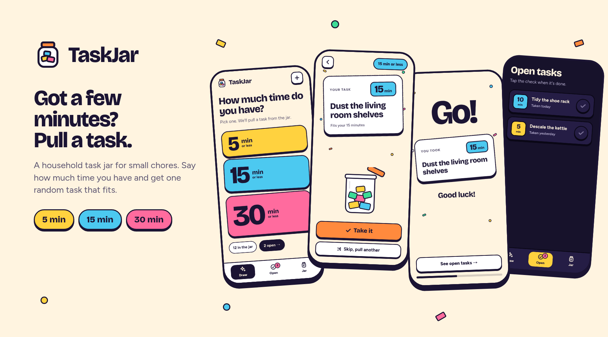
</p>

<h1 align="center">TaskJar</h1>

<p align="center">
  <strong>A household task jar for small chores.</strong><br>
  Put short tasks in the jar. When you have a few free minutes, say how much time you have and pull one random task that fits.
</p>

<p align="center">
  <a href="https://github.com/jumpingmushroom/TaskJar/actions/workflows/ci.yml"></a>
  <a href="https://github.com/jumpingmushroom/TaskJar/pkgs/container/taskjar"></a>
  
  <a href="LICENSE"></a>
  <a href="https://buymeacoffee.com/jumpingmushroom"></a>
</p>

---

## Why

Big chore lists are discouraging. TaskJar flips it around: you only ever see **one** small task, picked for the time you actually have. There's no scorekeeping and no guilt, just a bright, bouncy nudge to get one thing done.

## Features

- **Two taps to a task.** Pick **5**, **15** or **30** minutes and TaskJar pulls a task that fits, with a shuffle animation.
- **Smart, not strict.** The pick is weighted towards tasks that use your time well, so a 30-minute draw rarely hands you a 2-minute job (but it can).
- **Skip freely.** "Skip, pull another" never repeats a task you already skipped in that draw, and tells you when nothing else fits.
- **The 30-minute rule.** Every task takes 30 minutes or less. Bigger jobs are politely rejected ("Too big! Split it into smaller tasks.") in the UI _and_ on the server.
- **Take it → Go! → done.** Taken tasks move to an Open list, and checking one off plays a small celebration.
- **One shared jar.** Data lives on your server, so every phone, tablet and wall panel sees the same jar live.
- **Made for home.** Mobile-first, with wide layouts for a landscape tablet, wall panel or desktop, and simple fades when "reduce motion" is on.
- **Light and dark.** Follows the system by default. The sun/moon button on the home screen overrides it for that device.
- **Self-hosted and private.** One small container with SQLite, and no accounts or cloud services.

## Screenshots

<table>
  <tr>
    <td align="center">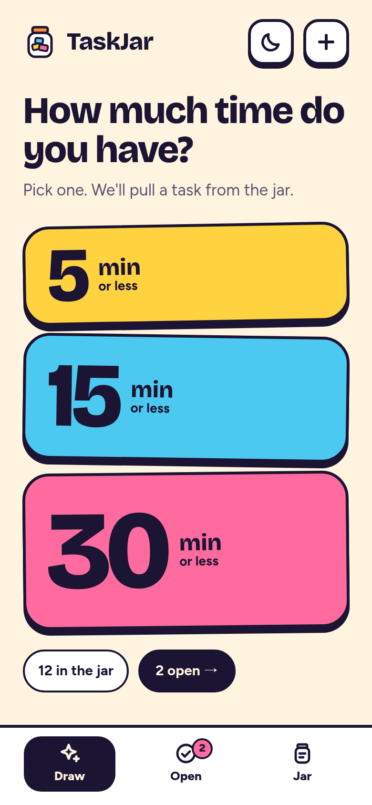<br><sub>Pick your time</sub></td>
    <td align="center">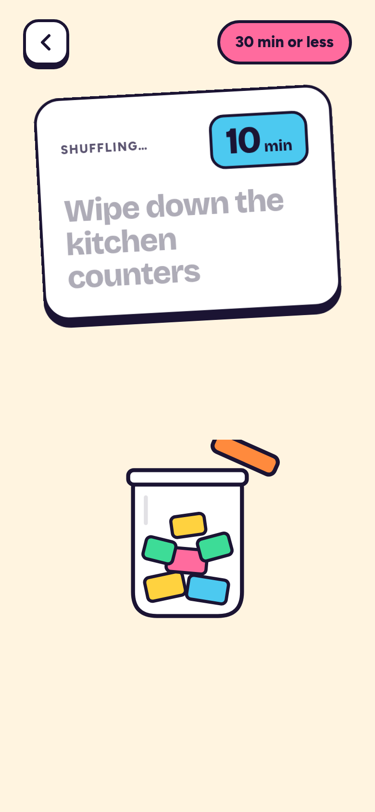<br><sub>Shuffle…</sub></td>
    <td align="center">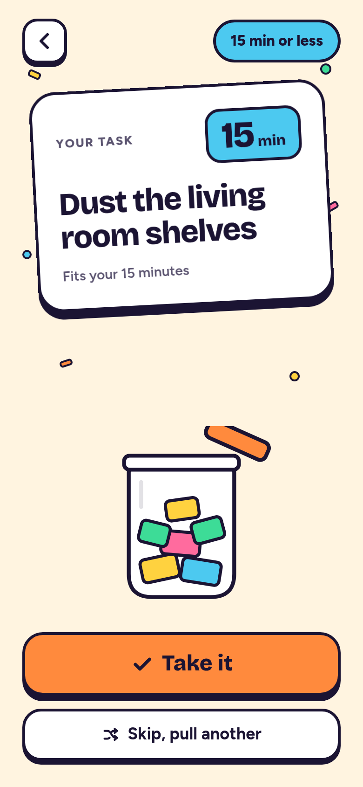<br><sub>…your task</sub></td>
    <td align="center">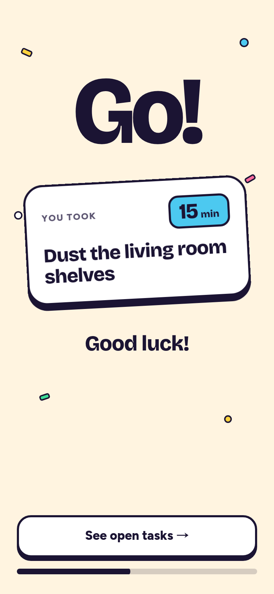<br><sub>Go!</sub></td>
  </tr>
  <tr>
    <td align="center">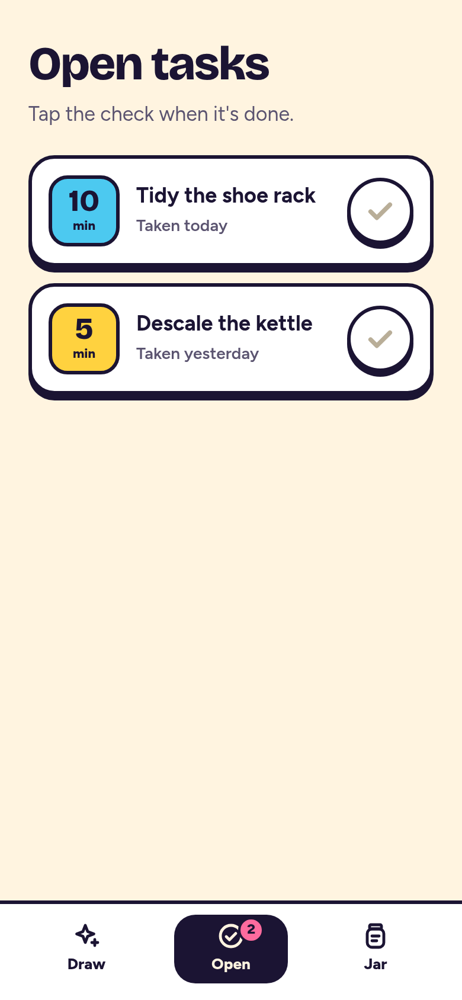<br><sub>Open tasks</sub></td>
    <td align="center">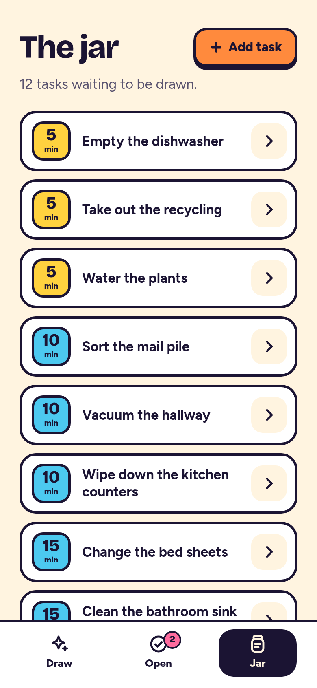<br><sub>The jar</sub></td>
    <td align="center">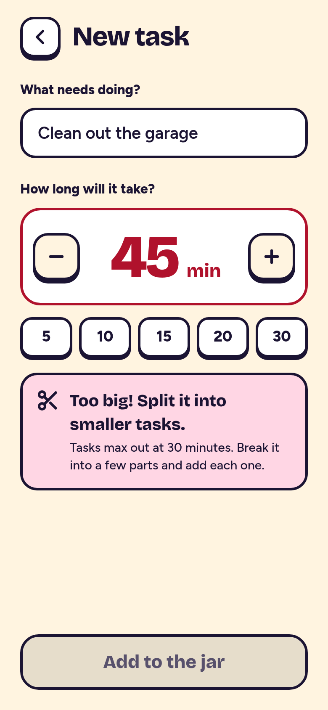<br><sub>The 30-minute rule</sub></td>
    <td align="center">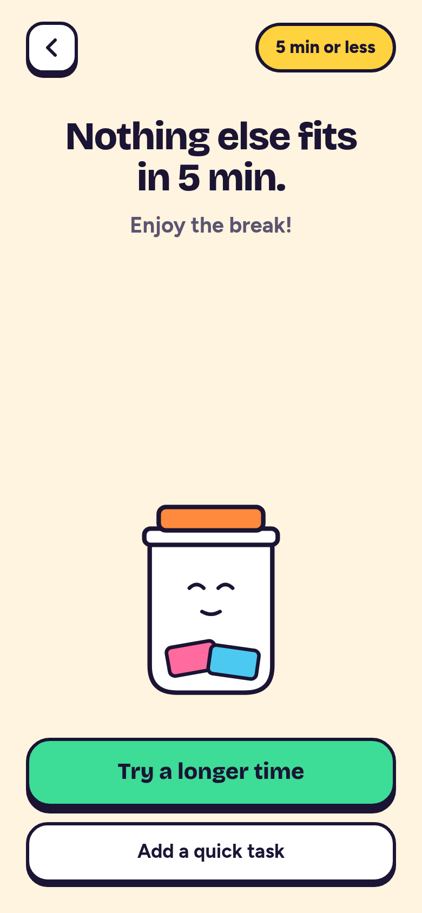<br><sub>Nothing fits</sub></td>
  </tr>
  <tr>
    <td align="center">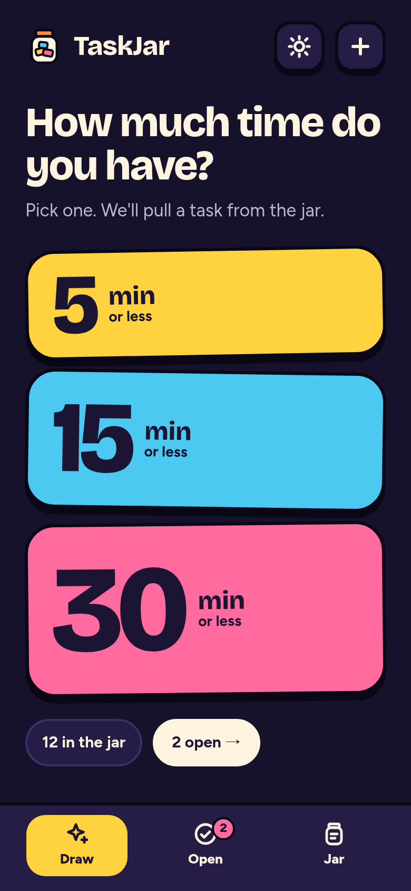<br><sub>Dark mode</sub></td>
    <td align="center">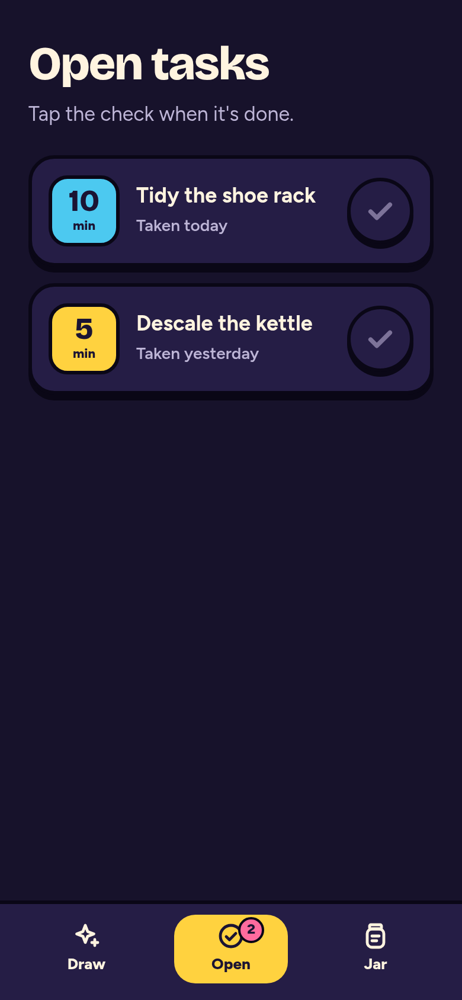<br><sub>Dark mode</sub></td>
    <td align="center" colspan="2">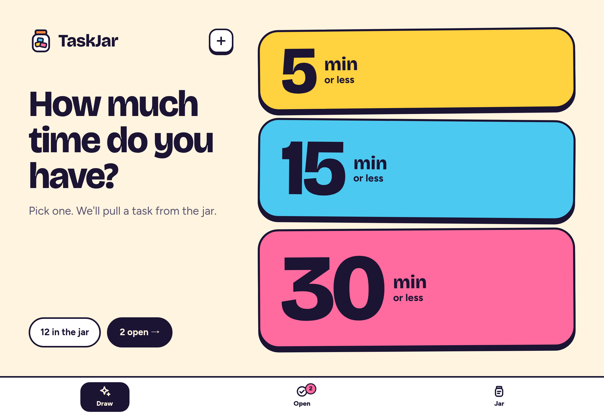<br><sub>Tablet and wall panel</sub></td>
  </tr>
  <tr>
    <td align="center" colspan="4">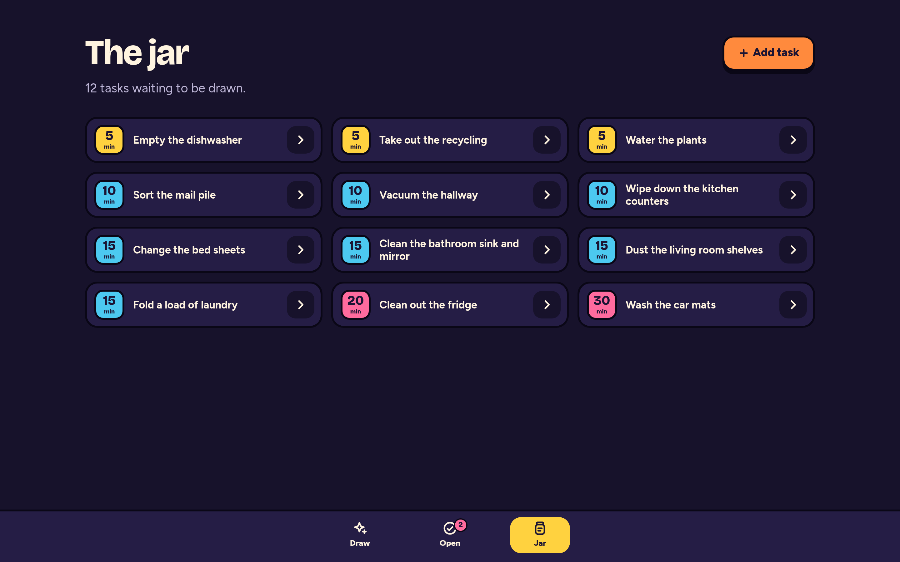<br><sub>Desktop</sub></td>
  </tr>
</table>

## How the draw works

1. **Candidates** are the tasks in the jar with a duration ≤ the button you pressed (each button means _up to_ N minutes).
2. **The pick** is weighted random with `weight = 0.35 + minutes / N`. Longer tasks make better use of the time, and the 0.35 floor keeps short ones possible.
3. **Skip** puts the task back in the jar and draws again from the same candidates, leaving out every task skipped in this draw. When none are left, you see "Nothing else fits".
4. **Take it** moves the task to _Open_. If someone on another device took it a moment earlier, TaskJar pulls a new one for you.

Every draw is logged (taken, skipped, abandoned or empty), and each task counts its skips. That's the groundwork for the features on the roadmap.

## Install

> [!IMPORTANT]
> TaskJar has **no login**: anyone who can reach it can read and change the jar. Run it on your home network only, and use a VPN or an authenticating reverse proxy if you need remote access. See [SECURITY.md](SECURITY.md).

The image is published to `ghcr.io/jumpingmushroom/taskjar` on every change to `main` that passes CI (`latest`, `sha-<commit>`), and on releases (`X.Y.Z`, `X.Y`).

### Unraid

The template and icon ship inside the image. Install them from the Unraid terminal:

```sh
docker run --rm --entrypoint cat ghcr.io/jumpingmushroom/taskjar:latest /app/unraid/taskjar.xml \
  > /boot/config/plugins/dockerMan/templates-user/my-TaskJar.xml
mkdir -p /var/lib/docker/unraid/images
docker run --rm --entrypoint cat ghcr.io/jumpingmushroom/taskjar:latest /app/unraid/icon.png \
  > /var/lib/docker/unraid/images/TaskJar-icon.png
```

The second command pre-caches the icon; Unraid otherwise downloads it from the template's icon URL. If the icon ever shows as a question mark, set **Icon URL** in the template to `http://<server-ip>:<port>/icon.png` (TaskJar serves its own icon).

Then go to **Docker → Add Container**, pick **TaskJar** from the template list, and set **App URL** to the exact address you'll open (for example `http://192.168.1.20:3000`, matching the WebUI port). Data goes to `/mnt/user/appdata/taskjar`, and the app runs as `nobody:users` (99:100). Unraid's normal "update available" check picks up new builds.

### Docker Compose

```sh
cp .env.example .env   # set ORIGIN to the URL you'll open
docker compose up -d --build
```

### Plain Docker

```sh
docker run -d --name taskjar -p 3000:3000 \
  -e ORIGIN=http://192.168.1.20:3000 \
  -v taskjar-data:/data \
  ghcr.io/jumpingmushroom/taskjar:latest
```

### Configuration

| Variable        | Default            | Notes                                                                                                                 |
| --------------- | ------------------ | --------------------------------------------------------------------------------------------------------------------- |
| `ORIGIN`        | _(required)_       | The exact URL people open the app on. Without it, every form submit fails with 403.                                   |
| `PORT`          | `3000`             | Port the app listens on inside the container.                                                                         |
| `PUID` / `PGID` | `1000` / `1000`    | User and group the app runs as. The container fixes ownership of `/data` at start. The Unraid template uses 99 / 100. |
| `DATABASE_URL`  | `/data/taskjar.db` | SQLite file inside the container. Migrations run automatically on start.                                              |

If you open the app on more than one hostname, `ORIGIN` only allows one of them. Instead, set `PROTOCOL_HEADER=x-forwarded-proto` and `HOST_HEADER=x-forwarded-host` behind a reverse proxy that sends those headers.

**Health:** `GET /healthz` returns `{"ok":true}` once the database answers, and the image's `HEALTHCHECK` uses it.
**Backup:** copy `taskjar.db` from the data folder while the app is stopped, or run `sqlite3 taskjar.db ".backup backup.db"` while it runs.

## Development

Requires Node 22 or newer.

```sh
npm install
npm run dev          # http://localhost:5173
npm test             # unit tests (Vitest)
npm run test:e2e     # Playwright smoke test against a production build
npm run check        # svelte-check / TypeScript
npm run lint         # Prettier + ESLint
npm run db:generate  # new migration after changing the schema
```

**Stack:** SvelteKit (Svelte 5, TypeScript, `adapter-node`), Drizzle ORM on SQLite (`better-sqlite3`), self-hosted Bricolage Grotesque and Figtree fonts, Vitest, Playwright, Docker.

```
src/lib/draw.ts            pure draw logic: candidates, weighted pick, skip exclusion
src/lib/task.ts            shared task rules and validation (browser and server)
src/lib/server/            Drizzle schema, repositories (tasks, draws)
src/lib/components/        design-system components (badges, cards, jar art, tab bar…)
src/routes/                Draw (/), reveal (/draw/[id]), Go! (/go/[id]), /open, /jar
e2e/                       acceptance checklist as a Playwright test
unraid/                    Unraid template and icon (copied into the image)
```

The app works without JavaScript: every action is a plain form post, and JS adds the animations on top.

**CI** (`.github/workflows/ci.yml`) runs on every PR:

- type check, lint, unit tests and the e2e suite
- builds and smoke-tests the container, including an Unraid-style run with PUID/PGID 99:100 and a restart to check that data persists

Merges to `main` publish the image. Pull requests are squash-merged with [Conventional Commits](https://www.conventionalcommits.org/) titles; see `CLAUDE.md` for the repo conventions.

## Roadmap

Planned after the MVP, roughly in this order:

- **Forcing:** a task skipped three times comes first whenever it fits, and can't be skipped.
- **Recurring tasks:** a done task comes back N days after completion.
- **People:** profiles, assignees ("anyone" or a person), and a household draw.
- **Seasonal tasks and ordered sequences:** a big job split into parts that unlock in order.
- **Wall panel:** a Home Assistant card that opens TaskJar.

## Contributing

Issues and pull requests are welcome; see [CONTRIBUTING.md](CONTRIBUTING.md).

## Credits

- Fonts: [Bricolage Grotesque](https://github.com/ateliertriay/bricolage) and [Figtree](https://github.com/erikdkennedy/figtree), both under the SIL Open Font License 1.1, self-hosted via [Fontsource](https://fontsource.org/).
- Built with [SvelteKit](https://svelte.dev/), [Drizzle ORM](https://orm.drizzle.team/) and [better-sqlite3](https://github.com/WiseLibs/better-sqlite3).

## Support

If TaskJar gets a few more chores done in your home, you can buy me a coffee:

<a href="https://buymeacoffee.com/jumpingmushroom"></a>

## License

[MIT](LICENSE) © Johnny Dalen
